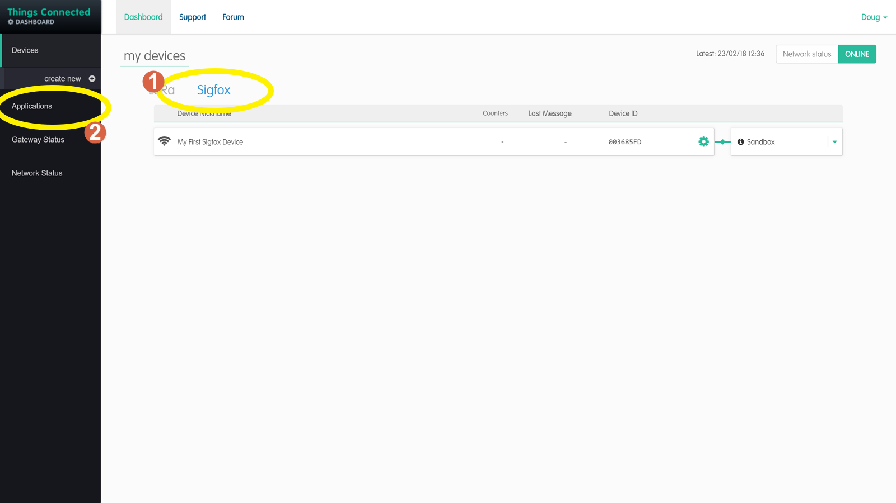
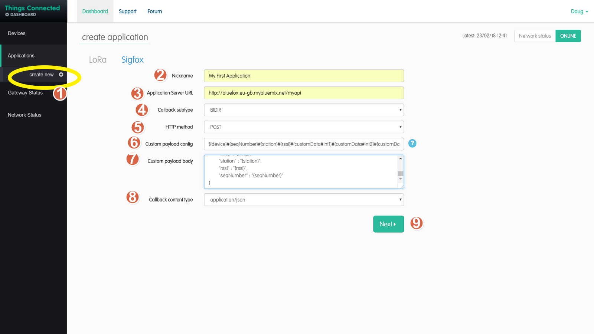

# Things-Connected-Create-an-Application
Creating a Sigfox application on the things connected portal

1. Select Sigfox to make sure we are creating a sigfox application
2. Select Applications on the left hand menu

1. Select create new on the menu on the left hand side this will display the form to create the application

