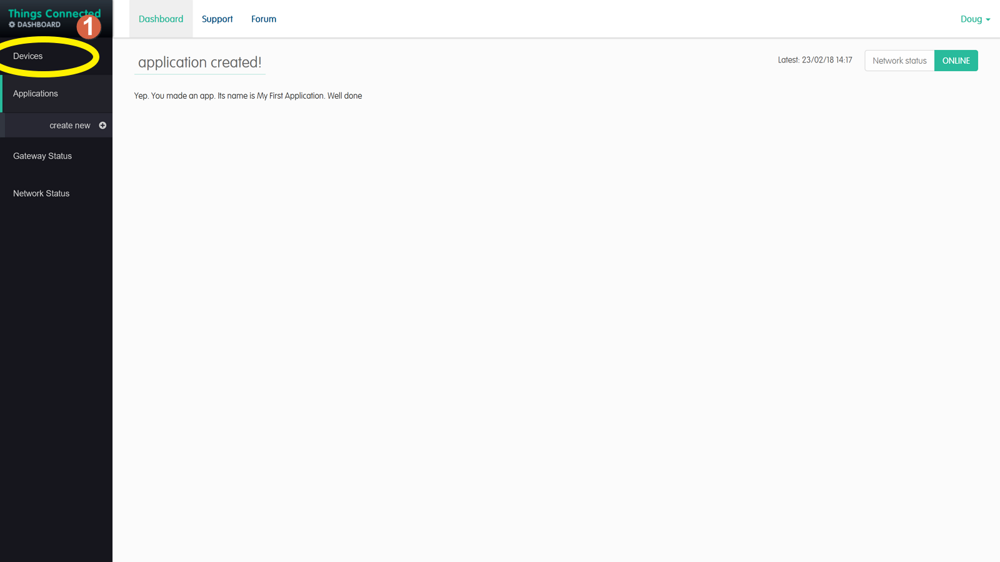
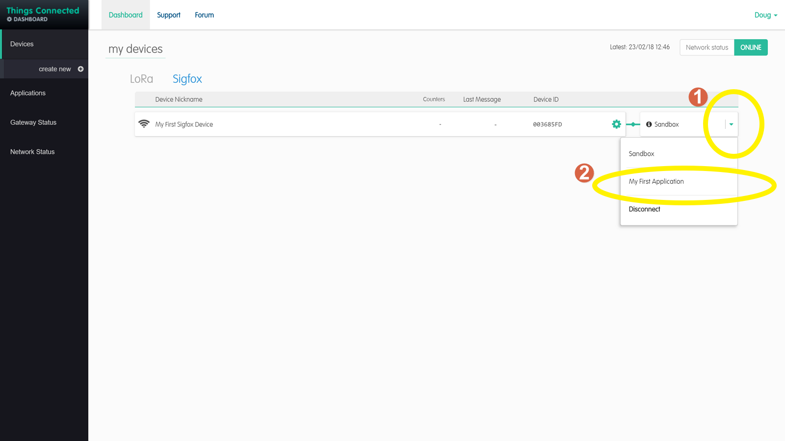
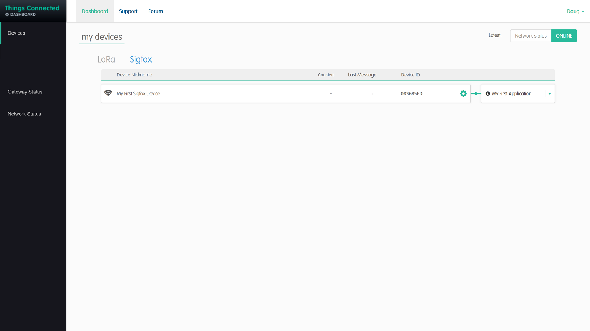

# Things-Connected-Create-an-Application
Creating a Sigfox application on the things connected portal

1. Select Sigfox to make sure we are creating a sigfox application
2. Select Applications on the left hand menu


1. Select create new on the menu on the left hand side this will display the form to create the application
2. Enter a name that you can idenify the application by.
3. Enter the URL of where the messages need to be sent
4. The callback subtype should be set to BIDIR so we can use two way messaging.
5. The HTTP method your server expects to recieve the messages by. As we are usually writing data this should be POST.
6. The formatting of the 12 bytes being recieved in this case we are converting the bytes into a decimal so 0-255.
```
int1::uint:8 int2::uint:8 int3::uint:8 int4::uint:8 int5::uint:8 int6::uint:8 int7::uint:8 int8::uint:8 int9::uint:8 int10::uint:8 int11::uint:8 int12::uint:8	
```
7. This formats the fields to be posted to your applicatin server.
```
{ 					
	"data1" : "{customData#int1}", 
	"data2" : "{customData#int2}", 
	"data3" : "{customData#int3}", 
	"data4" : "{customData#int4}", 
	"data5" : "{customData#int5}", 
	"data6" : "{customData#int6}", 
	"data7" : "{customData#int7}", 
	"data8" : "{customData#int8}", 
	"data9" : "{customData#int9}", 
	"data10" : "{customData#int10}", 
	"data11" : "{customData#int11}", 
	"data12": "{customData#int12}", 
	"device" : "{device}", 
	"deviceType" : "Bluefox", 
	"time" : "{time}", 
	"station" : "{station}", 
	"rssi" : "{rssi}", 
	"seqNumber" : "{seqNumber}" 
}
```

8. As we are sending JSON Formatted data we set this to application/json
9. Click next to complete the application setup


1. We now need to connect devices to our application. Select devices from the left hand menu



1. On the right hand side select the icon for the drop down box
2. Select your application from this list, in my case it was 'My First Application'




The box on the right hand side should now display your application connected to the chosen device.


